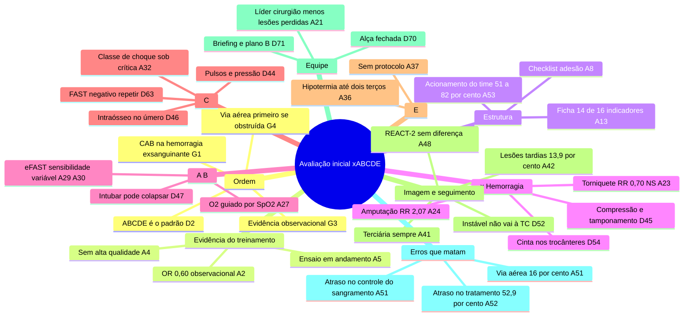

# T001 — Mapa conceitual

```mermaid
mindmap
  root((Avaliação inicial xABCDE))
    Ordem
      ABCDE é o padrão D2
      CAB na hemorragia exsanguinante G1
      Via aérea primeiro se obstruída G4
      Evidência observacional G3
    Evidência do treinamento
      OR 0,60 observacional A2
      Sem alta qualidade A4
      Ensaio em andamento A5
    Estrutura
      Checklist adesão A8
      Ficha 14 de 16 indicadores A13
      Acionamento do time 51 a 82 por cento A53
    x Hemorragia
      Compressão e tamponamento D45
      Torniquete RR 0,70 NS A23
      Amputação RR 2,07 A24
      Cinta nos trocânteres D54
    A B
      Intubar pode colapsar D47
      O2 guiado por SpO2 A27
      eFAST sensibilidade variável A29 A30
    C
      Pulsos e pressão D44
      Classe de choque sob crítica A32
      Intraósseo no úmero D46
      FAST negativo repetir D63
    E
      Hipotermia até dois terços A36
      Sem protocolo A37
    Imagem e seguimento
      REACT-2 sem diferença A48
      Instável não vai à TC D52
      Lesões tardias 13,9 por cento A42
      Terciária sempre A41
    Equipe
      Briefing e plano B D71
      Alça fechada D70
      Líder cirurgião menos lesões perdidas A21
    Erros que matam
      Via aérea 16 por cento A51
      Atraso no controle do sangramento A51
      Atraso no tratamento 52,9 por cento A52
```
