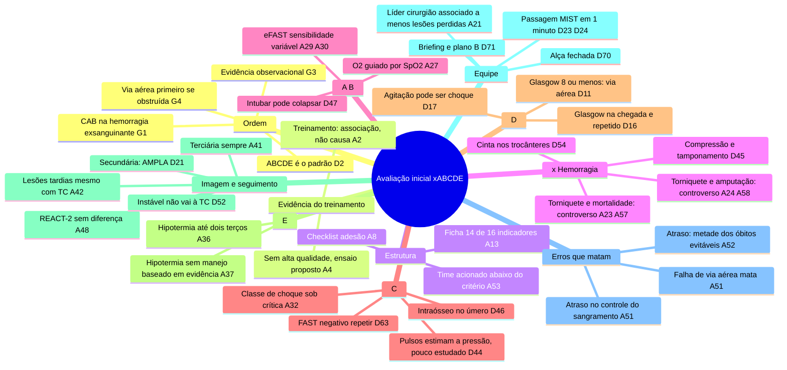

# T001 — Mapa conceitual

```mermaid
mindmap
  root((Avaliação inicial xABCDE))
    Ordem
      ABCDE é o padrão D2
      CAB na hemorragia exsanguinante G1
      Via aérea primeiro se obstruída G4
      Evidência observacional G3
    Evidência do treinamento
      Treinamento: associação, não causa A2
      Sem alta qualidade, ensaio proposto A4
    Estrutura
      Checklist adesão A8
      Ficha 14 de 16 indicadores A13
      Time acionado abaixo do critério A53
    x Hemorragia
      Compressão e tamponamento D45
      Torniquete e mortalidade: controverso A23 A57
      Torniquete e amputação: controverso A24 A58
      Cinta nos trocânteres D54
    A B
      Intubar pode colapsar D47
      O2 guiado por SpO2 A27
      eFAST sensibilidade variável A29 A30
    C
      Pulsos estimam a pressão, pouco estudado D44
      Classe de choque sob crítica A32
      Intraósseo no úmero D46
      FAST negativo repetir D63
    D
      Glasgow na chegada e repetido D16
      Glasgow 8 ou menos: via aérea D11
      Agitação pode ser choque D17
    E
      Hipotermia até dois terços A36
      Hipotermia sem manejo baseado em evidência A37
    Imagem e seguimento
      REACT-2 sem diferença A48
      Instável não vai à TC D52
      Secundária: AMPLA D21
      Lesões tardias mesmo com TC A42
      Terciária sempre A41
    Equipe
      Briefing e plano B D71
      Alça fechada D70
      Passagem MIST em 1 minuto D23 D24
      Líder cirurgião associado a menos lesões perdidas A21
    Erros que matam
      Falha de via aérea mata A51
      Atraso no controle do sangramento A51
      Atraso: metade dos óbitos evitáveis A52
```
